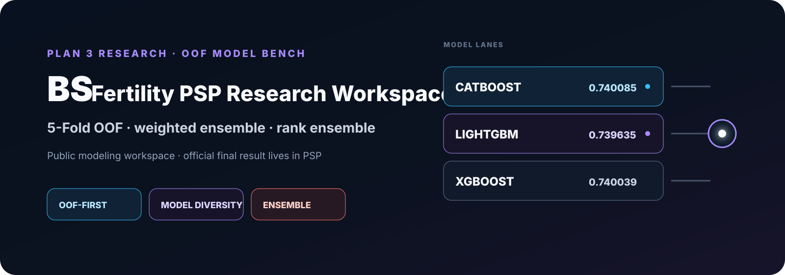
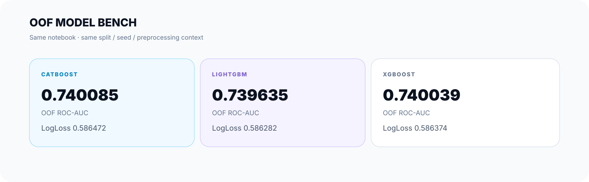
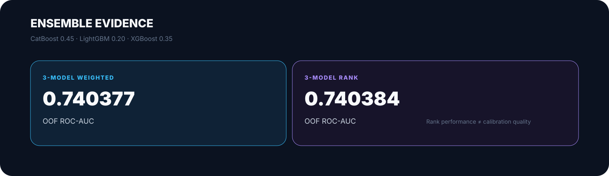

<picture>
  <source media="(max-width: 640px)" srcset="./docs/assets/readme/hero-mobile.svg" />
  
</picture>

<h1 align="center">BS — Fertility PSP Research Workspace</h1>

  <strong>Plan 3 연계 모델 비교 · 5-Fold OOF · Weighted / Rank Ensemble</strong> 
  Public modeling workspace · not the official final artifact

## Start Here

이 저장소는 Plan 3 연계 모델 비교와 OOF ensemble을 기록하는 **research workspace**입니다.

- **공식 결과 / artifact provenance** — [PSP](https://github.com/nanimnoworry/PSP)
- **연구 Notebook** — [plan3_model_research.ipynb](plan3_model_research.ipynb)

공식 최종 결과는 PSP, 모델별 OOF 근거는 BS에서 확인합니다.

## OOF Model Bench

<picture>
  <source media="(max-width: 640px)" srcset="./docs/assets/readme/model-bench-mobile.svg" />
  
</picture>

이 수치는 **동일 Notebook의 split · seed · 전처리 조건 안에서만 비교**합니다.

<strong>개별 모델 수치</strong>

- **CatBoost** — OOF ROC-AUC 0.740085 · LogLoss 0.586472
- **LightGBM** — OOF ROC-AUC 0.739635 · LogLoss 0.586282
- **XGBoost** — OOF ROC-AUC 0.740039 · LogLoss 0.586374

## Ensemble Evidence

<picture>
  <source media="(max-width: 640px)" srcset="./docs/assets/readme/ensemble-evidence-mobile.svg" />
  
</picture>

가중치는 CatBoost **0.45** · LightGBM **0.20** · XGBoost **0.35**입니다.

- **Weighted ensemble** — OOF ROC-AUC **0.740377**
- **Rank ensemble** — OOF ROC-AUC **0.740384**

Rank 조합은 ROC-AUC와 probability calibration 특성이 다를 수 있어 LogLoss와 분리해 해석합니다.

## Research Context

Notebook 기준 Train **256,351 × 69**, Test **90,067 × 68**, 공식 지표는 ROC-AUC입니다. 구조적 결측과 시술 맥락을 먼저 해석한 뒤 세 boosting 모델과 ensemble을 비교했습니다.

<strong>Feature work & Notebook provenance</strong>

<pre>
treatment_x_specific_proc
age_x_specific_proc
transfer_per_created_embryo
stored_per_created_embryo
mixed_per_fresh_oocyte
icsi_oocyte_rate
</pre>

Historical filename: **3안 모델.ipynb의 사본**  
Current public filename: **plan3_model_research.ipynb**

Public Notebook은 code-cell output과 execution count를 제거한 sanitized 상태이며, provenance는 [PSP sanitation record](https://github.com/nanimnoworry/PSP/blob/main/docs/PUBLIC_NOTEBOOK_SANITIZATION.md)에 기록합니다.

## Official Boundary

BS는 공식 3안과 관련된 연구 기록이지만 **BS Notebook 자체가 공식 final artifact라는 뜻은 아닙니다.**

- **Highest submitted:** 2안 · **0.74232**
- **Final adopted submission model:** 3안 · **0.74231**
- Canonical lineage와 artifact identity는 [PSP](https://github.com/nanimnoworry/PSP)를 기준으로 합니다.

## Scope & Related Research

[Organization overview](https://github.com/nanimnoworry) · planB *(private)* · Research-Papers *(private)*

**Scope boundary:** 해커톤·연구 결과이며 실제 의료 환경의 임상 검증, 진단 또는 의사결정 성능을 주장하지 않습니다. **Not a clinical diagnostic or medical decision system.**

---

### License and Rights

**Public view · no public reuse license.** Notebook 원천 데이터 · 내장 출력 · 의존 라이브러리 · 제3자 자료는 각 권리·조건을 따릅니다.

[LICENSE](LICENSE) · [RIGHTS.md](RIGHTS.md) · [CONTRIBUTORS.md](CONTRIBUTORS.md)
